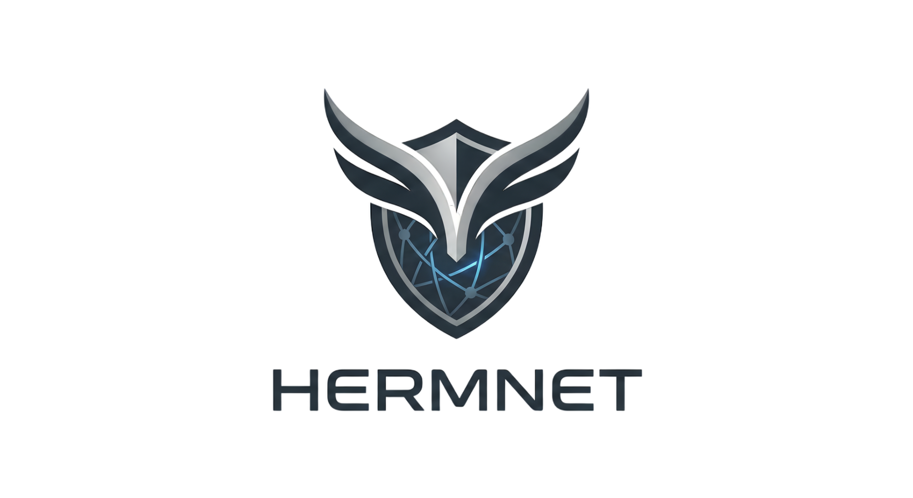

<p align="center">
  
</p>

<p align="center">
  
  
  
  
  
  
  
</p>

<h3 align="center"><em>Mensajería privada con servidor ciego y cifrado de extremo a extremo</em></h3>

<div align="center">
  <h2>Web Oficial del Proyecto</h2>
  <p>
    <strong>Presentación visual, propuesta de valor y acceso público de Hermnet</strong>
  </p>
  <p>
    <a href="https://hermnet.github.io/Hermnet-Web/">
      
    </a>
  </p>
</div>

## Documentación

| Documento | Contenido |
|---|---|
| [Guía de arranque](./docs/guia_arranque.md) | Instalación, Firebase, comandos y problemas comunes |
| [Descripción técnica](./docs/technical/descripcion_detallada.md) | Visión técnica completa del sistema |
| [Cifrado híbrido E2EE](./docs/technical/cifrado_hibrido_e2ee.md) | Formato del paquete cifrado y flujo crypto |
| [Autenticación](./docs/technical/protocolo_autenticacion.md) | Challenge-response, JWT y PIN local |
| [Arquitectura backend](./docs/technical/arquitectura_backend_api.md) | API REST, seguridad y servidor ciego |
| [Base de datos](./docs/technical/esquema_base_datos.md) | Tablas del backend y SQLite local |
| [Intercambio de claves](./docs/technical/intercambio_claves_p2p.md) | QR, fingerprint y validación anti-spoofing |
| [Casos de uso](./docs/technical/casos-uso.md) | Funcionalidades principales del sistema |
| [Gestión empresarial con Odoo](./docs/odoo/gestion_empresarial_odoo.md) | Entorno Odoo, módulo empresarial, datos demo y uso para empresas |
| [Plan de empresa](./docs/empresa/plan_empresa_Hermnet.md) | Modelo de negocio, clientes objetivo, marketing, sostenibilidad y previsión económica |

## Qué Es Hermnet

Hermnet es una app móvil de mensajería privada desarrollada como proyecto final de DAM. Su idea principal es sencilla: el servidor transporta mensajes, pero no puede leerlos.

La identidad no depende de teléfono ni correo. Cada usuario genera en su dispositivo un par de claves RSA-2048. El identificador `HNET-...` se deriva de la clave pública, y los mensajes se cifran extremo a extremo con un esquema híbrido AES-256-GCM + RSA-OAEP-SHA256.

## Highlights Técnicos

- **Cifrado E2EE híbrido**: AES-256-GCM para el contenido y RSA-OAEP-SHA256 para encapsular la clave efímera.
- **Servidor zero-knowledge**: Spring Boot solo guarda payloads cifrados opacos en un buzón temporal.
- **Autenticación sin contraseña**: challenge-response firmado con la clave privada del usuario y JWT HS256 con blacklist por `jti`.
- **Identidad sin datos personales**: no hay teléfono, email ni contraseñas en servidor.
- **Base local cifrada**: historial, contactos y preferencias viven en SQLite local, con cifrado en reposo desde la app.
- **Cola offline**: los envíos se encolan y reintentan cuando vuelve la conexión.
- **Camuflaje visual de mensajes**: los mensajes antiguos se ocultan al reabrir el chat, manteniendo visibles los nuevos/no leídos.
- **Blind push opcional**: Firebase puede despertar la app sin enviar texto ni preview del mensaje.
- **Tor-ready en Android**: módulo nativo local para enrutar por hidden service cuando está disponible, con fallback clearnet.
- **Gestión empresarial con Odoo**: módulo propio para gestionar empresas, planes, nodos privados, dispositivos, políticas y solicitudes de despliegue.
- **Calidad verificada**: backend con JaCoCo y umbral obligatorio de cobertura; frontend con TypeScript estricto y tests Jest.

## Stack

| Capa | Tecnología |
|---|---|
| App móvil | Expo SDK 54, React Native 0.81, TypeScript |
| Criptografía móvil | `react-native-quick-crypto` con fallback JS controlado |
| Estado/local | Zustand, Expo SecureStore, Expo SQLite |
| Backend | Java 17, Spring Boot, Spring Security, Maven |
| Base de datos servidor | PostgreSQL |
| Gestión empresarial | Odoo 17 + PostgreSQL |
| Tests | JUnit + JaCoCo, Jest + jest-expo, TypeScript strict |

## Arranque Rápido

Requisitos principales:

- Node.js + npm.
- Java 17 o superior.
- Maven.
- Docker Desktop abierto.
- Android Studio o Xcode si vas a compilar la app nativa.

Después de clonar:

```bash
bash scripts/bootstrap.sh
bash scripts/doctor.sh
```

Arrancar backend:

```bash
bash dev.sh backend
```

Arrancar Metro:

```bash
bash dev.sh metro
```

Compilar app nativa:

```bash
bash dev.sh android
# o
bash dev.sh ios
```

Arrancar Odoo empresarial:

```bash
bash dev.sh odoo
```

> Hermnet no está pensada para Expo Go porque usa módulos nativos. La primera vez hay que crear un development build con Android/iOS.

Guía completa: [docs/guia_arranque.md](./docs/guia_arranque.md).

## Firebase

El JSON de Firebase Admin SDK es opcional en desarrollo. Si falta, el backend arranca igualmente y desactiva las push notifications.

Para activar push, coloca el JSON en:

```text
backend/src/main/resources/hermnet-6d85d-firebase-adminsdk-fbsvc-fdf1bb4af7.json
```

O configura otra ruta en `backend/.env`:

```env
FIREBASE_SERVICE_ACCOUNT_PATH=/ruta/al/firebase-admin.json
```

El JSON no debe subirse a Git.

## Verificación

Backend:

```bash
cd backend
mvn verify
```

El build falla si la cobertura de líneas del backend baja del 98%.

Frontend:

```bash
cd frontend
npx tsc --noEmit
npm test -- --runInBand
```

Estado verificado en la última limpieza:

- Backend: `mvn verify` correcto.
- Cobertura backend: `99.28%`.
- Frontend TypeScript: correcto.
- Frontend tests: `9` suites, `33` tests.

## Autoría

Proyecto desarrollado por:

- [@franciscorodalf](https://github.com/franciscorodalf)
- [@alvarogrlp](https://github.com/alvarogrlp)
