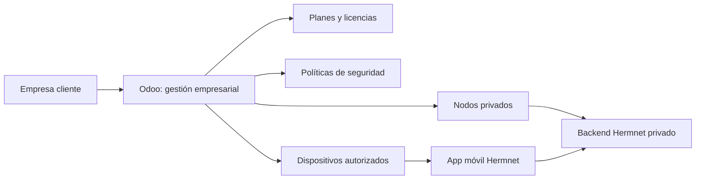

# Gestión empresarial con Odoo

## Objetivo

Hermnet incorpora un apartado de Odoo para cubrir la parte de gestión empresarial del proyecto.

La app móvil y el backend siguen siendo el núcleo de mensajería privada. Odoo se utiliza como sistema de gestión para empresas que quieran usar Hermnet en entornos privados, con control de clientes, planes, nodos, dispositivos, políticas y solicitudes de despliegue.

## Qué problema resuelve

Una empresa que adopta Hermnet necesita gestionar información operativa que no pertenece directamente al chat:

- Qué empresas usan Hermnet.
- Qué plan tiene contratado cada empresa.
- Qué nodos privados están desplegados.
- Qué dispositivos están autorizados.
- Qué políticas de seguridad se aplican.
- Qué solicitudes de despliegue o soporte están abiertas.
- Qué entorno usa cada cliente: desarrollo, preproducción o producción.

Odoo permite gestionar esa parte administrativa y mostrar que Hermnet puede integrarse en un entorno empresarial real.

## Estructura añadida

```text
odoo/
├─ docker-compose.yml
├─ .env.example
├─ config/
│  └─ odoo.conf
├─ addons/
│  └─ hermnet_enterprise_connector/
│     ├─ __manifest__.py
│     ├─ models/
│     │  └─ hermnet_enterprise.py
│     ├─ security/
│     │  └─ ir.model.access.csv
│     ├─ views/
│     │  └─ hermnet_enterprise_views.xml
│     └─ data/
│        └─ demo_data.xml
└─ README.md
```

## Servicios Docker

El entorno incluye dos servicios:

| Servicio | Imagen | Uso |
|---|---|---|
| `odoo` | `odoo:17.0` | Aplicación web de gestión |
| `odoo-db` | `postgres:15-alpine` | Base de datos propia de Odoo |

Puertos:

| Servicio | Puerto |
|---|---:|
| Odoo web | `8069` |
| Odoo longpolling | `8072` |
| PostgreSQL Odoo | `55432` |

La base de datos de Odoo está separada de la base de datos del backend Hermnet. Esto evita mezclar datos operativos de mensajería con datos de gestión empresarial.

## Arranque

Desde la raíz del proyecto:

```bash
bash dev.sh odoo
```

También puede arrancarse manualmente:

```bash
cd odoo
cp .env.example .env
docker compose up -d
```

Abrir en navegador:

```text
http://localhost:8069
```

Master password de desarrollo:

```text
hermnet-admin-master
```

## Instalación del módulo

Una vez creada la base de datos en Odoo:

1. Entrar con el usuario administrador.
2. Ir a `Apps`.
3. Actualizar la lista de aplicaciones si el módulo no aparece.
4. Buscar `Hermnet Enterprise Connector`.
5. Instalar el módulo.

Después aparecerá un menú nuevo:

```text
Hermnet Empresas
```

## Funcionalidades del módulo

### Empresas

Permite registrar empresas cliente con:

- Nombre.
- Contacto Odoo asociado.
- CIF/NIF.
- Sector.
- Estado comercial.
- Plan contratado.
- Licencias contratadas.
- Responsable técnico.
- Dominios permitidos.
- Fechas de alta y renovación.
- Notas internas.

Estados posibles:

- Lead.
- Piloto.
- Activo.
- Suspendido.
- Cerrado.

### Planes

Permite definir planes de servicio:

- Hermnet Starter.
- Hermnet Business.
- Hermnet Sovereign.

Cada plan incluye:

- Código interno.
- Precio mensual.
- Usuarios incluidos.
- Nodos privados incluidos.
- Soporte.
- Onboarding.
- Notas.

### Nodos privados

Representan despliegues privados de Hermnet para una empresa.

Campos principales:

- Empresa.
- Entorno: desarrollo, preproducción o producción.
- Estado: planificado, desplegando, online, mantenimiento u offline.
- URL base.
- URL Onion opcional.
- Región.
- Proveedor/VPS.
- Nombre de base de datos backend.
- Límite diario de mensajes.
- Último healthcheck.

### Dispositivos

Permite controlar qué dispositivos están asociados a una empresa.

Campos:

- Nombre visible.
- Empresa.
- Nodo asignado.
- Hash/ID Hermnet.
- Plataforma: Android, iOS, escritorio o desconocido.
- Versión de app.
- Estado: pendiente, activo, bloqueado o perdido.
- Push configurado.
- Bloqueo de capturas obligatorio.

### Políticas de seguridad

Define reglas recomendadas por empresa:

- PIN obligatorio al abrir.
- Bloqueo de capturas.
- Backups permitidos o no.
- Contraseña obligatoria en backup.
- Efecto Matrix permitido.
- Grupos permitidos.
- Grupos solo administradores por defecto.
- Longitud mínima de PIN.
- Retención local recomendada.

### Solicitudes de despliegue

Sirven para gestionar tareas operativas:

- Nuevo nodo.
- Migración.
- Actualización.
- Incidencia.
- Formación.

Incluyen prioridad, estado, fechas, requisitos y resultado.

## Datos demo

El módulo incluye datos de ejemplo para enseñar la funcionalidad:

- Plan Starter.
- Plan Business.
- Plan Sovereign.
- Clínica Atlas.
- Lexnova Legal.
- Nodos privados.
- Políticas de seguridad.
- Dispositivos.
- Solicitudes de despliegue.

Estos datos ayudan a demostrar en la defensa cómo Hermnet puede utilizarse en un contexto empresarial.

## Informes empresariales

El addon incluye un informe PDF llamado `Ficha empresarial Hermnet`. Se genera desde una empresa cliente en Odoo y resume:

- Datos principales de la empresa.
- Plan contratado.
- Licencias contratadas y usadas.
- Nodos privados.
- Políticas de seguridad.
- Solicitudes de despliegue.

Este informe cubre la parte de formularios e informes empresariales de la rúbrica SSG.

## Relación con Hermnet

Odoo gestiona la parte administrativa. Hermnet gestiona la mensajería.



## Valor para la rúbrica

Este apartado refuerza:

- Integración con sistemas empresariales.
- Uso de Docker.
- Uso de PostgreSQL.
- Separación entre producto técnico y gestión operativa.
- Documentación de despliegue.
- Modelo de negocio y explotación del proyecto.
- Posible continuidad con Odoo/SSG visto en clase.

## Notas de producción

Para producción habría que:

- Cambiar todas las contraseñas.
- Usar HTTPS.
- Configurar backups.
- Proteger el acceso a PostgreSQL.
- Usar secretos externos.
- Separar volúmenes por entorno.
- Restringir permisos por roles.
- Conectar Odoo con el backend Hermnet mediante API si se quiere sincronización real.
