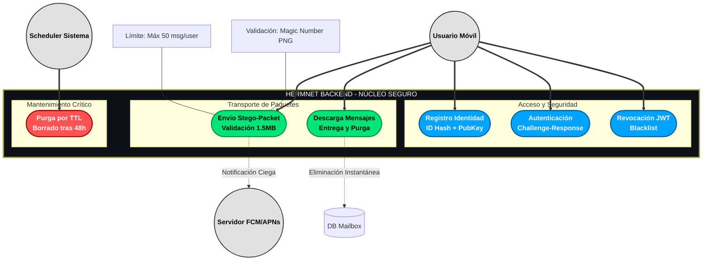

# Diagrama de Casos de Uso del Sistema Hermnet

Este diagrama representa las interacciones funcionales del sistema Hermnet, diseñado bajo la arquitectura de "Servidor Ciego" (Blind Server). En este modelo, el servidor actúa únicamente como un intermediario de transporte ciego, sin conocimiento del contenido de los mensajes ni de la identidad real de los usuarios.

## Descripción de Actores

*   **Usuario Móvil**: El cliente final que utiliza la aplicación Hermnet. Posee las claves privadas necesarias para descifrar los paquetes esteganográficos.
*   **Servidor FCM/APNs**: Servicios externos de notificación (Firebase / Apple) que reciben alertas de "Nuevo Mensaje" sin contenido sensible, solo para despertar la aplicación del destinatario.
*   **Scheduler Sistema (CronJob)**: Un proceso interno del servidor que se ejecuta periódicamente para mantener la higiene y seguridad de la base de datos.

## Descripción de Casos de Uso

El sistema se divide en tres grupos lógicos para garantizar la seguridad y el rendimiento:

### 1. Grupo de Identidad (Acceso y Seguridad)
Este módulo gestiona la confianza cero entre el cliente y el servidor.

*   **Registro de Identidad**: El usuario registra su `ID Hash` (un identificador anónimo) y su `Public Key`. No se almacenan correos, teléfonos ni contraseñas.
*   **Autenticación (Challenge-Response)**: Para iniciar sesión, el servidor envía un "reto" (nonce aleatorio) que el usuario debe firmar con su clave privada. Esto permite autenticar sin jamás enviar la clave privada por la red.
*   **Revocación (Blacklist)**: Permite invalidar tokens JWT comprometidos o cerrar sesiones activas, añadiéndolos a una lista negra (`BlacklistedToken`) en el servidor.

### 2. Grupo de Mensajería (Transporte de Paquetes)
El núcleo de la funcionalidad de "buzón muerto" (Dead Drop).

*   **Envío de Stego-Packet**: El usuario sube una imagen (PNG) que contiene el mensaje cifrado oculto. El servidor valida que sea una imagen válida y que no supere el tamaño máximo (1.5MB), pero **no puede** leer el contenido.
*   **Descarga de Mensajes**: El usuario consulta su buzón usando su hash. Al descargar los mensajes, estos pueden ser opcionalmente eliminados del servidor inmediatamente para garantizar *Forward Secrecy*.

### 3. Grupo de Limpieza (Mantenimiento Crítico)
Procesos automáticos para evitar la retención de datos.

*   **Purga por TTL (Time-to-Live)**: El scheduler elimina automáticamente cualquier mensaje o challenge de autenticación que tenga más de 48 horas de antigüedad, asegurando que el servidor no se convierta en un historial permanente de comunicaciones.