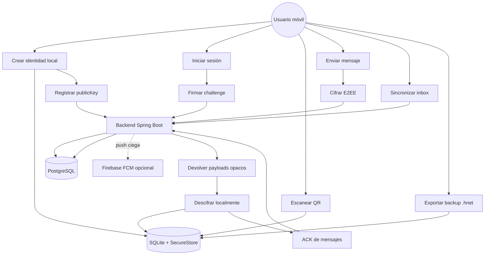

# Casos de Uso

```mermaid
flowchart TD
    User((Usuario móvil))
    Backend[Backend Spring Boot]
    DB[(PostgreSQL)]
    Local[(SQLite + SecureStore)]
    FCM[Firebase FCM opcional]

    User --> UC1[Crear identidad local]
    UC1 --> Local
    UC1 --> UC2[Registrar publicKey]
    UC2 --> Backend --> DB

    User --> UC3[Iniciar sesión]
    UC3 --> UC4[Firmar challenge]
    UC4 --> Backend

    User --> UC5[Escanear QR]
    UC5 --> Local

    User --> UC6[Enviar mensaje]
    UC6 --> UC7[Cifrar E2EE]
    UC7 --> Backend
    Backend --> DB
    Backend -. push ciega .-> FCM

    User --> UC8[Sincronizar inbox]
    UC8 --> Backend
    Backend --> UC9[Devolver payloads opacos]
    UC9 --> UC10[Descifrar localmente]
    UC10 --> Local
    UC10 --> UC11[ACK de mensajes]
    UC11 --> Backend

    User --> UC12[Exportar backup .hnet]
    UC12 --> Local
```

## Actores

- **Usuario móvil**: crea identidad, añade contactos, envía y recibe mensajes.
- **Backend**: autentica, transporta payloads cifrados y limpia datos temporales.
- **Firebase FCM**: opcional; solo despierta la app con una señal vacía.

## Casos Principales

### Crear Identidad

La app genera RSA-2048 localmente, deriva el HNET-id desde la clave pública y guarda la identidad en SecureStore.

### Autenticarse

El usuario firma un nonce temporal. El servidor verifica la firma y emite JWT.

### Añadir Contacto

El usuario escanea un QR con HNET-id y clave pública. La app recalcula el fingerprint y rechaza claves que no correspondan al ID.

### Enviar Mensaje

La app cifra el sobre con AES-256-GCM + RSA-OAEP-SHA256, guarda copia local y envía el payload opaco al backend.

### Recibir Mensaje

La app descarga payloads, descifra localmente, valida anti-spoofing/anti-replay, guarda en SQLite y envía ACK.

### Usar Offline

Si no hay red, los envíos quedan en `sync_queue` y se reintentan cuando vuelve la conexión.

### Exportar/Importar Backup

`RecoveryService` genera un archivo `.hnet` cifrado con PBKDF2 + AES-256-GCM.
