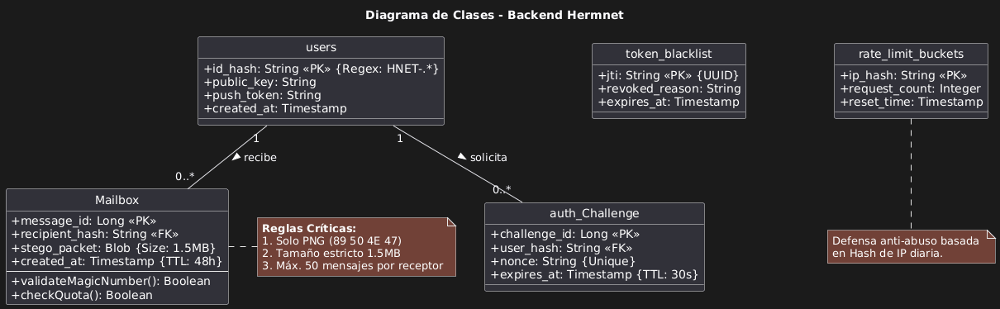

# Diagrama de Clases

A continuación se presenta el diagrama de clases del proyecto Hermnet, que ilustra la estructura de las clases principales tanto en el backend (Spring Boot) como en el frontend (React Native), así como sus interacciones y la persistencia de datos.

## Descripción del Diagrama

El diagrama se divide en tres componentes principales que interactúan para proporcionar la funcionalidad segura de mensajería de Hermnet:

### 1. Backend (Java / Spring Boot)

Esta sección representa la lógica del servidor que gestiona la identidad pública de los usuarios.

- **User**: Es la entidad fundamental del sistema. Almacena:
  - `id`: Identificador único del usuario.
  - `publicKey`: La clave pública utilizada para la criptografía asimétrica (Ed25519).
  - `createdAt`: Fecha de creación del registro.
  - Métodos como `onCreate()` aseguran que la fecha se establezca automáticamente antes de la persistencia.

- **UserRepository**: Interfaz que extiende de `JpaRepository`. Proporciona los métodos necesarios para interactuar con la base de datos del servidor, permitiendo operaciones CRUD y búsquedas personalizadas como `findByPublicKey`.

- **HermnetApiApplication**: La clase principal que arranca la aplicación Spring Boot.

### 2. Frontend (React Native / TypeScript)

Esta sección detalla la aplicación móvil que utilizan los usuarios finales.

- **App**: Componente raíz de la aplicación React Native.
- **IdentityService**: Servicio crítico encargado de la seguridad criptográfica. Genera los pares de claves (pública y privada) y crea la identidad del usuario (`Identity`).
- **Identity (Interface)**: Define la estructura de una identidad, asegurando que siempre se manejen el `id`, la `publicKey` y la `privateKey`.
- **DatabaseService**: Gestiona la conexión con la base de datos local SQLite del dispositivo. Inicializa las tablas necesarias y provee la instancia de la base de datos a la aplicación.

### 3. Base de Datos Local (SQLite)

Representa la persistencia de datos en el dispositivo del usuario, esencial para la seguridad y privacidad.

- **key_store**: Tabla segura donde se almacenan las claves cifradas (`encrypted_key`) asociadas a un alias (`key_alias`). Solo el usuario con su contraseña maestra (implícita en el diseño de seguridad) debería poder acceder a estas claves.
- **contacts_vault**: Tabla que almacena la información pública de los contactos (`name`, `public_key`), permitiendo al usuario verificar la identidad de los remitentes y cifrar mensajes para ellos.
