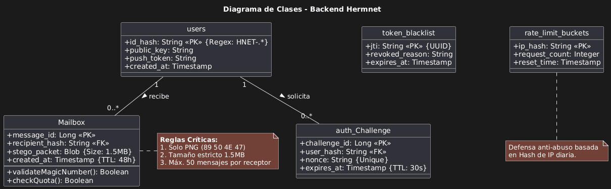
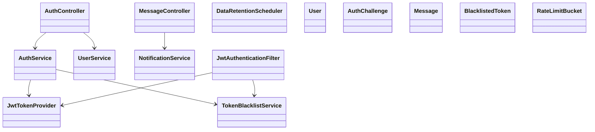

# Diagrama de Clases

El diagrama visual está en:

Si la imagen queda desactualizada, esta vista textual resume la estructura real actual.

## Backend

```mermaid
classDiagram
    class AuthController
    class MessageController
    class AuthService
    class UserService
    class TokenBlacklistService
    class NotificationService
    class DataRetentionScheduler
    class JwtTokenProvider
    class JwtAuthenticationFilter
    class User
    class AuthChallenge
    class Message
    class BlacklistedToken
    class RateLimitBucket

    AuthController --> AuthService
    AuthController --> UserService
    MessageController --> NotificationService
    AuthService --> JwtTokenProvider
    AuthService --> TokenBlacklistService
    JwtAuthenticationFilter --> JwtTokenProvider
    JwtAuthenticationFilter --> TokenBlacklistService
```

Entidades principales:

- `User`: HNET-id, clave pública, push token opcional.
- `AuthChallenge`: nonce temporal de login.
- `Message`: payload cifrado del buzón.
- `BlacklistedToken`: JWT revocado por `jti`.
- `RateLimitBucket`: contador por cliente anonimizado.

## Frontend

Servicios principales:

- `IdentityService`: genera identidad RSA y firma nonces.
- `AuthFlowService`: orquesta register/challenge/login.
- `ApiClient`: HTTP, JWT interceptor, fallback 401/403.
- `MessageCryptoService`: cifrado híbrido E2EE.
- `MessageFlowService`: envío, recepción, ACK, cola offline y anti-replay.
- `DatabaseService`: SQLite, migraciones, historial y contactos.
- `ContactsService`: alta, edición y flags locales de contactos.
- `RecoveryService`: export/import `.hnet`.

Pantallas principales:

- `HomeScreen`, `PinScreen`, `LoadingScreen`.
- `ChatsScreen`, `ChatRoomScreen`, `QRScannerScreen`, `ShowQRScreen`.
- `SettingsScreen` y subpantallas de seguridad, privacidad, apariencia, transferencia y ayuda.
