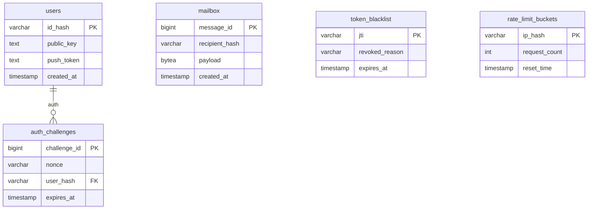

# Esquema de Base de Datos

Hermnet separa la persistencia en dos mundos:

- Backend PostgreSQL: buzón temporal y seguridad.
- Frontend SQLite: identidad operativa, contactos, historial y preferencias.

## 1. Backend PostgreSQL

### `users`

| Columna | Tipo | Uso |
|---|---|---|
| `id_hash` | `varchar(64)` | HNET-id del usuario |
| `public_key` | `text` | Clave pública RSA-2048 |
| `push_token` | `text` | Token FCM opcional |
| `created_at` | `timestamp` | Fecha de alta |

### `auth_challenges`

| Columna | Tipo | Uso |
|---|---|---|
| `challenge_id` | `bigint` | ID interno |
| `nonce` | `varchar(64)` | Reto temporal |
| `user_hash` | `varchar(64)` | Usuario que solicita login |
| `expires_at` | `timestamp` | Caducidad del reto |

### `mailbox`

| Columna | Tipo | Uso |
|---|---|---|
| `message_id` | `bigint` | Orden técnico de inserción |
| `recipient_hash` | `varchar(64)` | Destinatario |
| `payload` | `bytea` | Blob cifrado E2EE |
| `created_at` | `timestamp` | Momento de entrada |

### `token_blacklist`

| Columna | Tipo | Uso |
|---|---|---|
| `jti` | `varchar(36)` | ID del JWT revocado |
| `revoked_reason` | `varchar(20)` | Motivo: `LOGOUT`, `REFRESH`, etc. |
| `expires_at` | `timestamp` | Caducidad natural del token |

### `rate_limit_buckets`

| Columna | Tipo | Uso |
|---|---|---|
| `ip_hash` | `varchar(64)` | Cliente anonimizado |
| `request_count` | `int` | Peticiones en ventana |
| `reset_time` | `timestamp` | Fin de ventana |

## 2. Frontend SQLite

Tablas principales:

| Tabla | Uso |
|---|---|
| `contacts_vault` | Contactos, clave pública, alias cifrado y preferencias |
| `messages_history` | Historial local por contacto |
| `sync_queue` | Cola offline de mensajes pendientes |
| `incoming_seq` | Control anti-replay |
| `pending_ephemeral` | Propuestas de mensajes temporales |

SQLite local es la fuente de verdad del historial. El backend solo guarda mensajes en tránsito.

## 3. Migraciones

`SchemaMigrationRunner` contiene migraciones puntuales que Hibernate no puede inferir bien, por ejemplo renombrar `stego_packet` a `payload` tras eliminar la capa antigua de esteganografía.
